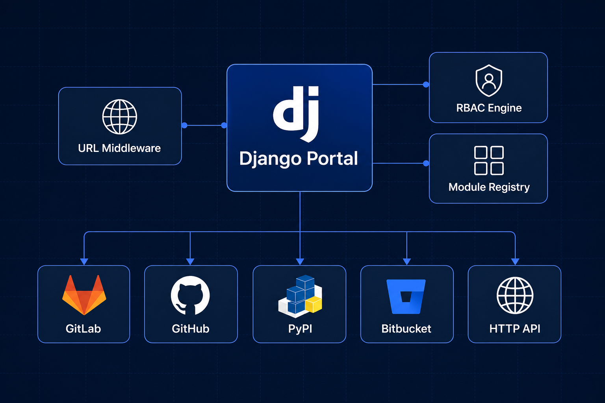
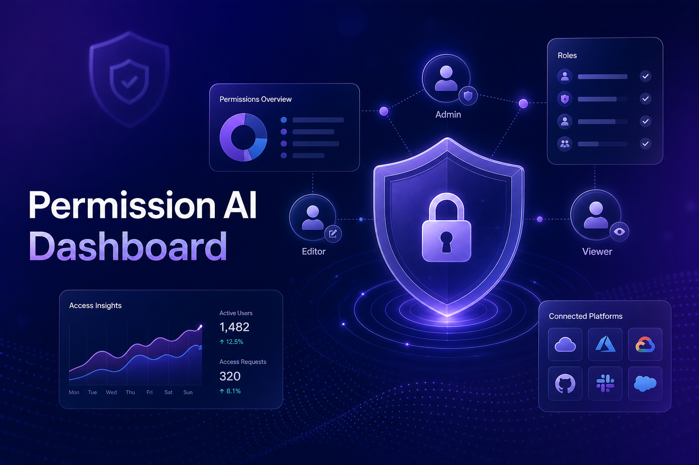
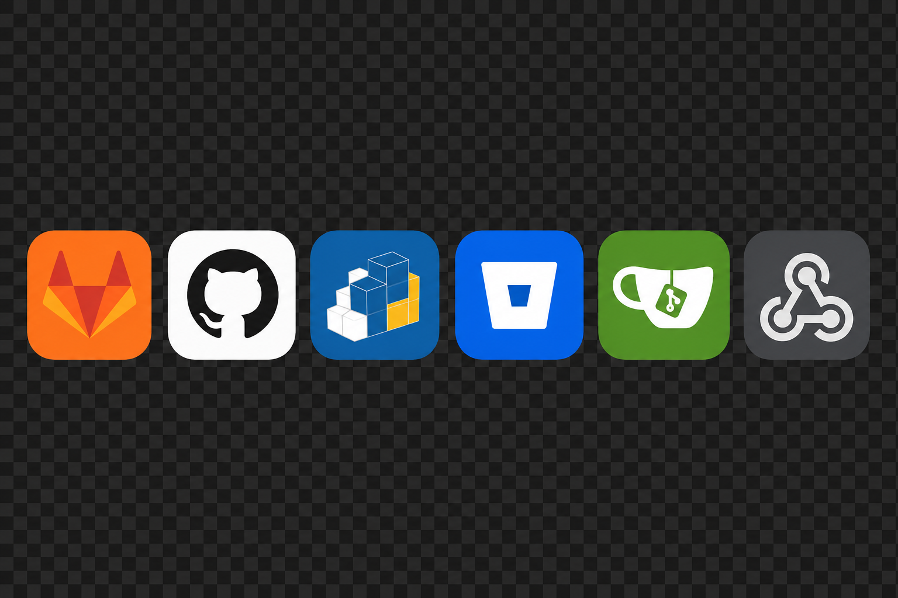

# Django Users Permission System

Reusable Django app for **URL-based RBAC**, module menus, and **multi-platform user sync**.



Works as a drop-in plugin for any Django project. Supports generic HTTP webhooks plus native adapters for GitLab, GitHub, Bitbucket, Gitea/Forgejo, and PyPI-style registries.

## Features

- URL-level permission checks via middleware
- Database-driven module registry (`AppModule`)
- Roles + direct user permissions (`Role`, `UserAccessControl`)
- Pluggable permission modules via settings
- Multi-platform outbound sync (`ExternalSyncEndpoint`)
- Configurable label aliases (settings, DB, or plugins)
- **AI Dashboard** with stats, platform overview, and setup assistant
- **Full documentation** with architecture and platform guides

## AI Dashboard & Documentation

Mount URLs in your project:

```python
# urls.py
path("permissions/", include("userspermissionsystem.urls")),
```

| Page | URL |
|------|-----|
| AI Dashboard | `/permissions/dashboard/` |
| Documentation | `/permissions/docs/` |
| AI Assistant API | `/permissions/api/ai-assistant/` |





Docs included in package:

- `docs/index.md` — overview
- `docs/installation.md` — setup guide
- `docs/architecture.md` — system design (with diagram)
- `docs/platforms.md` — GitLab, GitHub, PyPI, etc.
- `docs/plugins.md` — custom plugins & adapters
- `docs/roles.md` — generic role & permission API
- `docs/api.md` — API reference

## Install

```bash
pip install django-users-permission-system
# or from source:
pip install -e .
```

Add to `INSTALLED_APPS`:

```python
INSTALLED_APPS = [
    # ...
    "import_export",
    "userspermissionsystem.apps.UserspermissionsystemConfig",
]
```

Run migrations:

```bash
python manage.py migrate userspermissionsystem
```

## Django settings

```python
MIDDLEWARE = [
    # ...
    "userspermissionsystem.middleware.URLPermissionMiddleware",
]

TEMPLATES = [{
    # ...
    "OPTIONS": {
        "context_processors": [
            "userspermissionsystem.context_processors.base_context",
            "userspermissionsystem.context_processors.user_roles_context",
        ],
    },
}]

USER_PERMISSION_SYSTEM = {
  # URL prefixes to skip permission checks
  "SKIP_PREFIXES": ["/", "/login", "/logout", "/api/", "/admin/", "/static/", "/media/", "/permissions/"],

  # Treat these labels as the same module (configure per project)
  "LABEL_GROUPS": [
    ["orders", "order"],
  ],

  # Optional permission plugins (dotted paths)
  "PLUGINS": [
    "myapp.permissions.TicketsPermissionPlugin",
  ],

  # Optional custom platform adapters
  "PLATFORM_ADAPTERS": {
    "myplatform": "myapp.sync.MyPlatformAdapter",
  },

  # Privileged roles (replaces hardcoded "Admin")
  "ADMIN_ROLE_NAMES": ["admin"],

  # Optional nested permission map for UI flags
  "PERMISSION_CODE_GROUPS": {
    "orders_create": ("orders", "create"),
    "orders_view": ("orders", "view"),
  },
}
```

## Generic role permissions

```python
from userspermissionsystem.role_permissions import (
    user_has_permission_code,
    user_has_url_permission,
    user_has_module_access,
    user_has_role,
    user_is_privileged,
    get_grouped_permissions,
)

user_has_permission_code(user, "orders_create", app_label="orders")
user_has_url_permission(user, "/orders/create/", "POST", app_label="orders")
user_has_module_access(user, "orders")
user_has_role(user, "editor")
user_is_privileged(user)  # checks ADMIN_ROLE_NAMES
```

See `docs/roles.md` for full API.

## Platform sync setup

Create an `AppModule` with `base_url`, then add `ExternalSyncEndpoint` rows per event.

| Platform   | `platform_type` | `auth_config` example | `extra_config` example |
|-----------|-----------------|----------------------|------------------------|
| HTTP      | `http`          | `{"token": "...", "token_type": "Bearer"}` | `{"method": "POST", "timeout": 10}` |
| GitLab    | `gitlab`        | `{"token": "...", "token_type": "PRIVATE-TOKEN"}` | `{"group_id": 12, "access_level": 30}` |
| GitHub    | `github`        | `{"token": "ghp_..."}` | `{"org": "my-org", "team_slug": "developers"}` |
| Bitbucket | `bitbucket`     | `{"token": "...", "token_type": "Bearer"}` | `{"workspace": "myteam"}` |
| Gitea     | `gitea`         | `{"token": "..."}` | `{"group_id": 3}` |
| PyPI      | `pypi`          | `{"token": "..."}` | `{"scopes": ["upload"], "token_endpoint": "/api/v1/tokens/sync/"}` |

### Sync from signals

```python
from userspermissionsystem.sync import dispatch_sync_event

@receiver(post_save, sender=get_user_model())
def sync_user(sender, instance, created, **kwargs):
    payload = {
        "username": instance.username,
        "email": instance.email,
        "first_name": instance.first_name,
        "last_name": instance.last_name,
    }
    if created:
        dispatch_sync_event("create", instance, payload)
    else:
        dispatch_sync_event("update", instance, payload)
```

Backward-compatible HTTP URL helper:

```python
from userspermissionsystem.views import get_api_urls, sync_user_event

sync_user_event("create", user, payload)  # preferred
urls = get_api_urls("create")             # legacy HTTP-only
```

## Writing a permission plugin

```python
from userspermissionsystem.plugins.base import PermissionPlugin

class TicketsPermissionPlugin(PermissionPlugin):
    label = "tickets"

    def get_label_aliases(self):
        return {"tickets", "ticket"}
```

## Writing a custom platform adapter

```python
from userspermissionsystem.platforms.base import PlatformAdapter, SyncResult
from userspermissionsystem.platforms.registry import register_platform_adapter

class MyPlatformAdapter(PlatformAdapter):
    platform_type = "myplatform"

    def sync(self, endpoint, event_type, user, payload, permissions=None):
        # call external API
        return SyncResult(success=True, platform=self.platform_type, message="ok")

register_platform_adapter(MyPlatformAdapter())
```

## License

MIT
